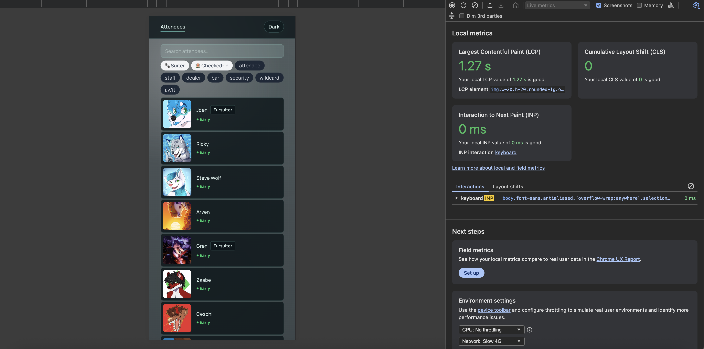

# Attendees View

A small app that fetches data from a public API and presents a list of event attendees in an accessible way, with several client-side filters.

Built on **TanStack Start**: data fetching happens server-side, list manipulation runs client-side, and attendee avatars are lazy-loaded to reduce initial page load.



## Requirements

- Node **v26.1.0**

## Setup and Test

```bash
npm install
npm run dev
```

## Building for production

```bash
npm run build
```

## Deploying with Nitro

This project uses Nitro as a generic server adapter, so it can run on any Node-compatible host.

```bash
npm run build
node dist/server/index.mjs
```

The build output is a self-contained Node server. To deploy, push the `dist/` directory to your host (Render, Fly.io, your own VPS, etc.) and run the server command above.

For host-specific presets (Vercel, Netlify, Cloudflare, AWS Lambda, etc.) and tuning, see https://v3.nitro.build/deploy.

## Styling

This project uses [Tailwind CSS](https://tailwindcss.com/) for styling.

## Linting & formatting

This project uses [ESLint](https://eslint.org/) and [Prettier](https://prettier.io/), with ESLint configured via [`tanstack/eslint-config`](https://tanstack.com/config/latest/docs/eslint).

```bash
npm run lint
npm run format
npm run check
```

## Research & design notes

**Why TanStack Start**

- Same framework as the target project, while being more than adequate for this scope.
- SSR support helps low-resource clients; React/TSX is familiar.
- Convenient defaults out of the box (Tailwind, Prettier, etc.).

**Other choices**

- Tailwind, because clean vanilla CSS isn't my strong suit.
- SSR for better performance on lower-end clients.
- Lazy-loading avatars to handle the large image payloads — a CDN with auto-resizing would be a better long-term fix.
- Few labels on mobile to improve space efficiency, leaning on UI elements to guide the user.
- Kept the CSS-variable-driven dark mode from the default template.

**Open questions**

- Runtime type validation: needed?